# 🚀 Pipeline Open Data - Acquisition et Enrichissement

# TP2 PIPELINE BIS
**— Pipeline d'acquisition et transformation de données**  
*Data Engineering - Open Data Pipeline*

---

## 📋 Table des Matières
- [🎯 Objectifs](#-objectifs)
- [🏗️ Architecture](#️-architecture)
- [📦 Installation](#-installation)
- [🚀 Utilisation](#-utilisation)
- [🧪 Tests](#-tests)
- [📊 Exemple de Sortie](#-exemple-de-sortie)
- [📁 Structure du Projet](#-structure-du-projet)
- [🎓 Critères TP Validés](#-critères-tp-validés)
- [🤖 IA Integration](#-ia-integration)
- [📈 Métriques de Qualité](#-métriques-de-qualité)
- [🔧 Dépendances](#-dépendances)
- [👥 Auteurs](#-auteurs)

---

## 🎯 Objectifs

Ce projet implémente un pipeline de production pour l'acquisition, l'enrichissement et la validation de données Open Data.

### Objectifs pédagogiques atteints :
1. ✅ **Interroger plusieurs APIs REST Open Data** (OpenFoodFacts + API Adresse)
2. ✅ **Enrichir des données** en croisant plusieurs sources
3. ✅ **Gérer pagination, erreurs et rate limiting**
4. ✅ **Implémenter un scoring de qualité** des données
5. ✅ **Transformer et nettoyer** des données avec l'aide de l'IA
6. ✅ **Stocker des données au format Parquet** avec partitionnement
7. ✅ **Générer un rapport de qualité** automatique
8. ✅ **Construire un pipeline reproductible et testé**

---

## 🏗️ Architecture


---

### Modules clés :
- **`fetchers/`** : Acquisition multi-sources avec retry et rate limiting
- **`enricher.py`** : Enrichissement croisé (géocodage des magasins)
- **`transformer.py`** : Nettoyage, validation et colonnes dérivées
- **`quality.py`** : Scoring qualité + rapports IA automatisés
- **`storage.py`** : Stockage Parquet avec partitionnement
- **`main.py`** : Orchestrateur complet avec logging professionnel

---

## 📦 Installation

### Prérequis
- Python 3.10+
- [UV](https://github.com/astral-sh/uv) (gestionnaire de paquets rapide)

### Installation rapide


### Cloner le dépôt
git clone https://github.com/Deep-KALYAN/open-data-ai-models-uv.git
cd tp2-pipeline

#### Installer les dépendances
uv add httpx pandas duckdb litellm python-dotenv tenacity tqdm pyarrow pydantic pytest

uv sync

#### Configuration API (optionnel)
cp .env.example .env
# Éditer .env avec vos clés API (Groq, Gemini, etc.)


### Dépendances principales
httpx : Requêtes HTTP asynchrones

pandas : Manipulation de données

pydantic : Validation des données

tenacity : Retry automatique

litellm : Intégration IA multi-fournisseurs

pyarrow : Format Parquet

### 🚀 Utilisation
#### Pipeline complet

### Lancer le pipeline complet
uv run python run_pipeline.py --category chocolats --max-items 100

### Options disponibles
uv run python run_pipeline.py --help

### Exemples :
uv run python run_pipeline.py --category biscuits --max-items 50
uv run python run_pipeline.py --category boissons --skip-enrichment --quiet
uv run python run_pipeline.py --category snacks --partition-by categories


### Utilisation programmatique

------------------------------
from pipeline.main import PipelineOrchestrator

orchestrator = PipelineOrchestrator(verbose=True)
stats = orchestrator.run_pipeline(
    category="chocolats",
    max_items=50,
    skip_enrichment=False
)

print(f"Note qualité: {stats['quality_grade']}")
print(f"Fichier généré: {stats['output_path']}")


🧪 Tests

### Tests unitaires
uv run pytest tests/ -v

### Avec couverture de code
uv run pytest tests/ -v --cov=pipeline --cov-report=html

### Tests spécifiques
uv run pytest tests/test_fetchers.py -v
uv run pytest tests/test_transformer.py -v

### 📊 Rapport de Qualité des Données
Généré le : 2025-12-16 17:45:37

### 📈 Métriques Globales
| Métrique          | Valeur | Statut |
|----------         |--------|--------|
| Note globale      | C      | ✅ Acceptable |
| Complétude        | 92.5%  | ✅ |
| Doublons          | 1.2%   | ✅ |
| Géocodage réussi  | 45.3%  | ⚠️ |

### 🤖 Recommandations IA
1. Améliorer le géocodage des adresses de magasins
2. Compléter les valeurs nutritionnelles manquantes
3. Standardiser les formats de marques
...

### Fichiers générés

```text
data/
├── raw/
│   └── chocolats_raw_20251216_174557.json     # Données brutes
├── processed/
│   └── chocolats_20251216_174557.parquet     # Données enrichies
└── reports/
    └── chocolats_quality_20251216_174557.md  # Rapport qualité


###    Structure du Projet

tp2-pipeline/
├── pipeline/                   # Code source
│   ├── __init__.py
│   ├── config.py               # Configuration centralisée
│   ├── models.py               # Modèles Pydantic (validation)
│   ├── fetchers/               # Acquisition multi-sources
│   │   ├── base.py             # Classe abstraite (retry, rate limiting)
│   │   ├── openfoodfacts.py    # API OpenFoodFacts
│   │   └── adresse.py          # API Adresse (géocodage)
│   ├── enricher.py             # Enrichissement croisé
│   ├── transformer.py          # Nettoyage et transformation
│   ├── quality.py              # Scoring qualité + IA
│   ├── ai_helper.py            # Gestion multi-fournisseurs IA
│   ├── storage.py              # Stockage Parquet
│   └── main.py                 # Orchestrateur principal
├── tests/                      # Tests unitaires
│   ├── test_fetchers.py
│   ├── test_transformer.py
│   ├── test_models.py
│   └── test_enricher.py
├── data/                       # Données générées
│   ├── raw/                     # JSON bruts
│   ├── processed/               # Parquet enrichis
│   └── reports/                 # Rapports qualité
├── notebooks/                  # Exploration (optionnel)
├── pyproject.toml              # Dépendances
├── requirements.txt            # Dépendances (backup)
├── .env.example                # Variables d'environnement
├── run_pipeline.py             # Script d'exécution
└── README.md                   # Cette documentation

```
### Description des modules principaux
#### pipeline/config.py
Configuration centralisée du pipeline :

Chemins des répertoires (data/, raw/, processed/, reports/)

Configuration des APIs (URLs, timeouts, rate limits)

Seuils de qualité (completeness_min, geocoding_score_min, etc.)

Paramètres d'acquisition (MAX_ITEMS, BATCH_SIZE)

#### pipeline/models.py
Modèles de données avec validation Pydantic :

Product : Modèle d'un produit alimentaire avec validation NutriScore

GeocodingResult : Résultat de géocodage avec score de confiance

QualityMetrics : Métriques de qualité du dataset avec scoring A-F

#### pipeline/fetchers/
Acquisition robuste avec :

BaseFetcher : Classe abstraite avec retry (tenacity), rate limiting, statistiques

OpenFoodFactsFetcher : Récupération paginée des produits alimentaires

AdresseFetcher : Géocodage d'adresses françaises

#### pipeline/enricher.py
Enrichissement croisé des données :

Extraction d'adresses uniques des produits

Cache de géocodage pour éviter les requêtes en double

Fusion des données géocodées avec les produits originaux

Statistiques d'enrichissement (taux de succès, échecs)

#### pipeline/transformer.py
Pipeline de transformation chaînable :

Suppression de doublons

Gestion des valeurs manquantes (médiane, moyenne, zéro, 'unknown')

Normalisation texte (strip, lowercase, accents)

Filtrage d'outliers (IQR, Z-score)

Colonnes dérivées (catégories de sucre, flags géocodés)

#### pipeline/quality.py
Analyse et scoring de qualité :

Calcul de métriques (complétude, doublons, géocodage)

Notation A-F basée sur des seuils configurables

Génération de rapports Markdown automatisés

Intégration IA pour recommandations (Groq, Gemini, Ollama)

#### pipeline/storage.py
Stockage professionnel :

Sauvegarde JSON brut (traçabilité)

Export Parquet avec compression snappy

Partitionnement optionnel par colonne

Chargement et recherche de fichiers

#### pipeline/main.py
Orchestrateur du pipeline :

Gestion des 5 étapes du pipeline

Logging structuré avec émoticônes et timestamps

Gestion d'erreurs avec retry et fallback

Interface CLI complète avec argparse


### 🤖 IA Integration
Fonctionnalités IA
Recommandations de qualité automatisées

Analyse du dataset généré

5 recommandations prioritaires générées

Format Markdown professionnel

Suggestions de transformation

Code pandas généré automatiquement

Adapté aux caractéristiques du dataset

Multi-fournisseurs supportés

Groq (recommandé - rapide et gratuit)

Ollama (local - modèles Mistral, Llama, etc.)

### Configuration
##### .env
GROQ_API_KEY=gsk_xxxxxxxxxxxxxxxxxxxxxxxxxxxxxxxx
##### Ollama utilise l'API locale par défaut (http://localhost:11434)

### 🔧 Dépendances
#### pyproject.toml
dependencies = [
    "httpx>=0.27.0",        # Requêtes HTTP asynchrones (meilleur que requests)
    "pandas>=2.0.0",        # Manipulation de données (DataFrames)
    "pydantic>=2.0.0",      # Validation de données (modèles)
    "tenacity>=8.2.0",      # Retry automatique (exponentiel backoff)
    "tqdm>=4.66.0",         # Barres de progression (UX)
    "pyarrow>=15.0.0",      # Format Parquet (stockage efficace)
    "litellm>=1.35.0",      # Abstraction multi-fournisseurs IA
    "python-dotenv>=1.0.0", # Variables d'environnement (.env)
    "duckdb>=0.10.0",       # Analyse SQL sur Parquet (optionnel)
]

### Développement & Tests
[project.optional-dependencies]
dev = [
    "pytest>=7.4.0",        # Framework de tests
    "pytest-cov>=4.1.0",    # Couverture de code
]

### APIs externes utilisées
#### OpenFoodFacts : Données produits alimentaires (gratuit, sans auth)

URL : https://world.openfoodfacts.org/api/v2

Rate limit : 1.5 secondes entre requêtes

User-Agent requis

#### API Adresse : Géocodage français (gratuit, sans auth)

URL : https://api-adresse.data.gouv.fr

Ultra-rapide (< 100ms)

Format GeoJSON avec score de confiance

#### APIs IA (optionnelles) :

Groq : groq/llama-3.3-70b-versatile (rapide, gratuit)


#### 👥 Auteurs
Étudiant : Deep Kalyan
Formation : Data Engineering - IPSSI
Promotion : 2025
TP : N°2 - Pipeline d'acquisition et transformation de données
Date de réalisation : Décembre 2025
Durée : 5 heures (conforme aux exigences du TP)

#### Contexte pédagogique
Ce projet a été réalisé dans le cadre du TP2 de la formation Data Engineering, avec les contraintes suivantes :

Durée limitée à 5 heures

Livrable : Pipeline Python complet + données enrichies + rapport qualité

Évaluation individuelle

Respect strict des objectifs pédagogiques définis

#### Compétences démontrées
Data Engineering : Conception et implémentation de pipelines ETL/ELT

APIs REST : Consommation, pagination, gestion d'erreurs, rate limiting

Qualité des données : Métriques, scoring, recommandations automatisées

Format Parquet : Stockage column-oriented pour l'analytique

Tests unitaires : Pytest, mocks, couverture de code

Intégration IA : Utilisation raisonnée des LLMs pour l'analyse

Documentation : README professionnel, code commenté

#### Remerciements
OpenFoodFacts : Pour leur API ouverte et documentation complète

API Adresse (data.gouv.fr) : Pour le service de géocodage performant

Groq : Pour leur API IA gratuite et rapide

Enseignants IPSSI : Pour l'encadrement pédagogique

Communauté Python : Pour les excellentes bibliothèques utilisées

#### 📄 License
Ce projet est un travail pédagogique réalisé dans le cadre de la formation Data Engineering de l'IPSSI.

Usage : Strictement éducatif et démonstratif
Données : Respect des conditions d'utilisation des APIs externes
Code : Libre d'utilisation pour apprentissage, avec mention d'origine

#### Disclaimer
Les APIs externes peuvent avoir des limites d'utilisation

Les clés API personnelles ne doivent pas être commitées

Ce pipeline est conçu pour des volumes modérés de données

Adapter les paramètres (rate limits, timeouts) selon vos besoins

### 🚨 Dépannage
#### Problèmes courants et solutions
#### 1. ImportError pour les modules
##### Réinstaller les dépendances
uv sync --reinstall
##### ou
uv pip install -r requirements.txt
#### 2. Timeout OpenFoodFacts
##### Augmenter le timeout dans config.py
OPENFOODFACTS_CONFIG = APIConfig(
    timeout=120,  # Augmenter de 60 à 120 secondes
    # ...
)
#### 3. Erreurs de géocodage
Vérifier que les adresses sont en français

Limiter le nombre d'adresses géocodées (max 50 par défaut)

Les adresses informelles ("Carrefour Paris") ont un score bas

#### 4. Tests qui échouent
#####  Nettoyer le cache pytest
uv run pytest --cache-clear

#####  Exécuter tests individuellement pour diagnostiquer
uv run pytest tests/test_fetchers.py::TestOpenFoodFactsFetcher -v

#### 5. Problèmes de mémoire avec Pandas
#####  Réduire MAX_ITEMS dans config.py
MAX_ITEMS = 200  # Au lieu de 500